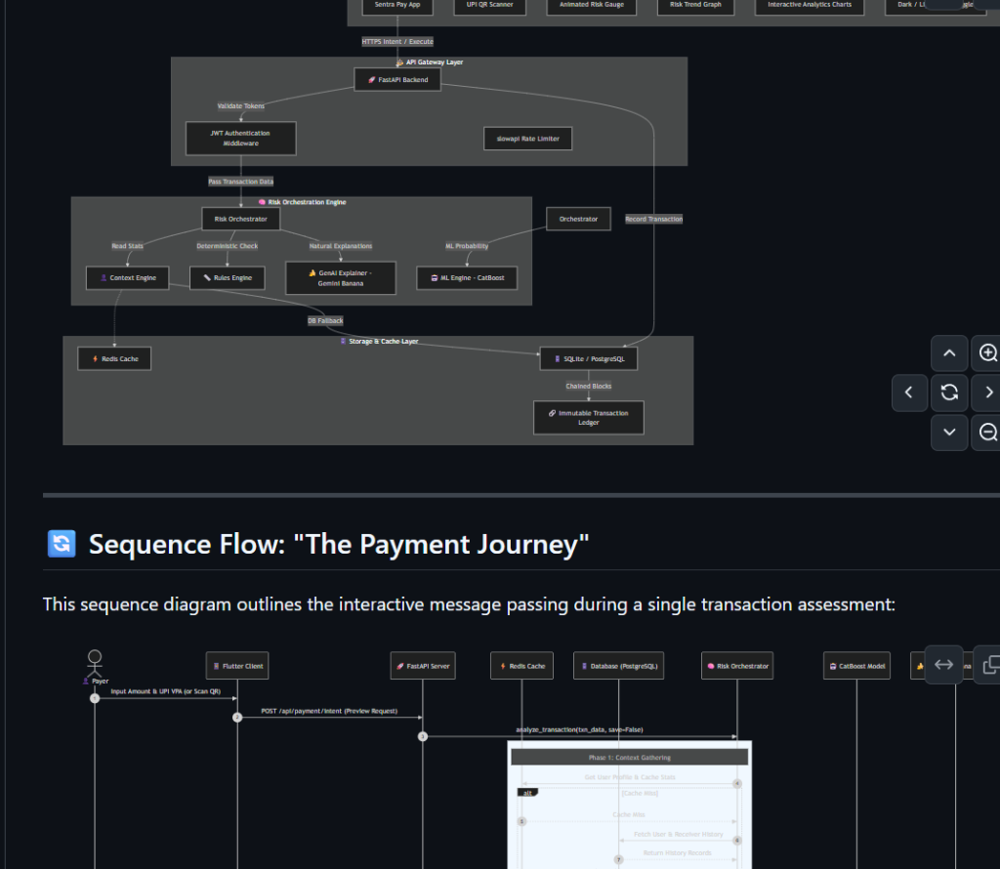
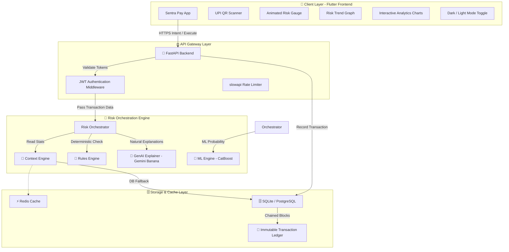
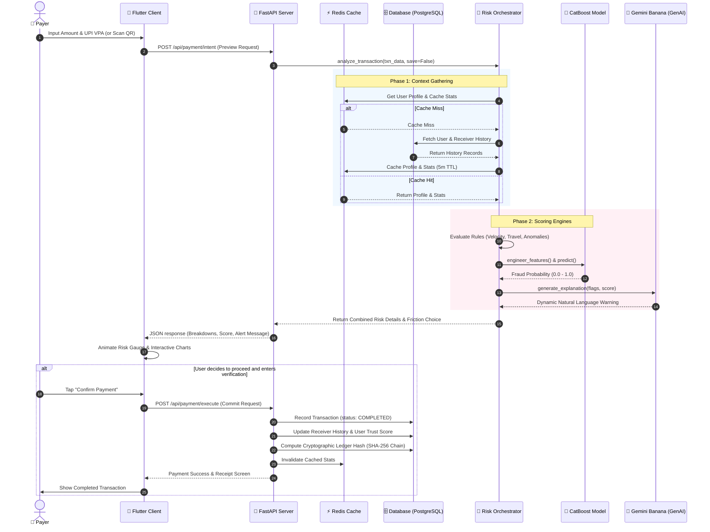
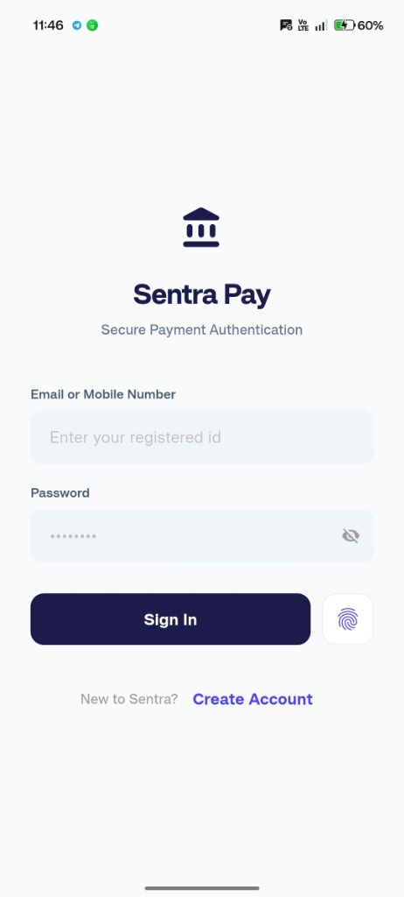
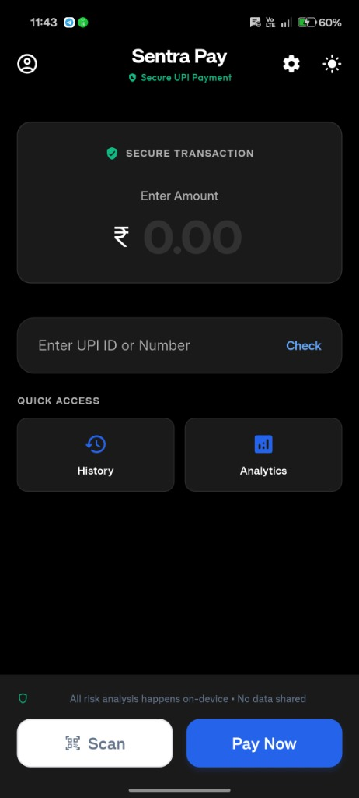
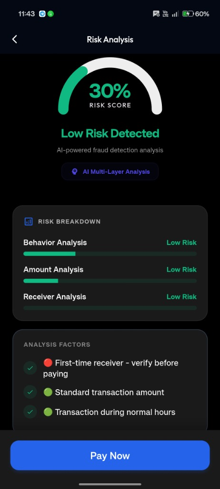
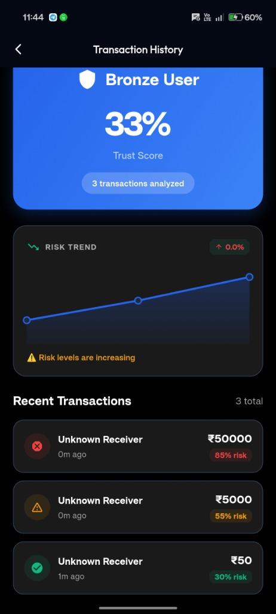

# 🛡️ Sentra Pay (DeepBlue Shield)
> **Intelligent, Real-time UPI Fraud Prevention | Advanced Risk Orchestration Engine**

[](https://fastapi.tiangolo.com/)
[](https://flutter.dev/)
[](https://catboost.ai/)
[](https://redis.io/)
[](https://www.postgresql.org/)

**Sentra Pay** (also known as DeepBlue Shield) is an advanced UPI fraud prevention system that assesses transaction risk **BEFORE** payment execution. Unlike traditional post-facto fraud systems, Sentra Pay intercepts threats in real time using a weighted combination of rule-based intelligence, machine learning (CatBoost), geo-velocity calculations, and Generative AI explanations (Project "Gemini Banana").

---

## 🚨 The Social Engineering Problem

* **95% of UPI fraud involves social engineering** (KYC scams, impersonation of government agencies, fake lottery prizes, urgent job registration fees) rather than direct technical hacks.
* **Gaps in existing apps**:
  * ❌ No pre-payment risk assessment (money is sent first, flagged later).
  * ❌ No receiver history verification (blind trust of UPI IDs).
  * ❌ No behavioral profiling (urgency and anomaly detection).
  * ❌ Inadequate user education (no explanations or warning signs at critical moments).

---

## ⚙️ How Sentra Pay Works: The Pre-Payment Friction

```
[User Initiates Pay] 
       │
       ▼
[FastAPI Gateway] ──(Queries)──► [Context Engine] (Redis / Postgres)
       │                                │ (Computes 22 features, user tenure, stats)
       ▼                                ▼
[Risk Orchestrator] ◄───────────────────┘
       ├─► [Rules Engine] (Velocity, Geo-velocity, Amount anomalies)
       ├─► [ML Engine] (CatBoost inference on 7 core features)
       └─► [GenAI Explainer] (Gemini Banana generates user-friendly descriptions)
       │
       ▼
[Decision Engine] (Aggregates weighted scores & applies transaction friction)
       │
       ├─► LOW RISK     (<= 0.30) ──► Approved / Safe (🟢)
       ├─► MEDIUM RISK  (0.30-0.60) ─► Show warning / micro-tips (🟠)
       ├─► IDENTITY RISK (Travel) ───► Escalates to OTP authentication (🔵)
       └─► HIGH RISK    (>= 0.80) ───► Blocked / Prevented (🔴)
```

---

## 📐 System Block Diagram

Below is the high-level architecture of Sentra Pay showing how components integrate:



<details>
<summary>🛠️ View Source Mermaid Diagram Code</summary>


</details>

---

## 🔄 Sequence Flow: "The Payment Journey"

This sequence diagram outlines the interactive message passing during a single transaction assessment:



---

## 🎨 Professional UX/UI (Flutter Client)

The user interface of Sentra Pay is designed to make AI assessment transparent and interactive:

* **Animated Risk Gauge**: Renders the risk levels dynamically (🟢 Safe, 🟠 Warning, 🔵 Verification, 🔴 Blocked) with smooth transitions.
* **Risk Factor Breakdowns**: Interactive breakdown bars for **Behavior (30%)**, **Amount (30%)**, and **Receiver Reputation (40%)**.
* **Risk Trend Graph**: Custom canvas-painted line graph showcasing the user's risk exposure progression across their last 10 payments.
* **Community Alerts Banner**: Crowdsourced reporting signals (e.g., *"⚠️ 12 users reported this account"*).
* **Dark Mode support**: Professional, unified dark slate theme (`#0F172A`).

### 📱 App UI Gallery

| 1. Authentication | 2. Home Screen |
|:---:|:---:|
|  |  |
| **3. Risk Analysis** | **4. Transaction History** |
|  |  |

---

## ⚙️ Feature Engineering & Model Vectors

Sentra Pay's backend implements an advanced preprocessing engine mapping transaction parameters to **22 unique features** compatible with our CatBoost classifier:

| Feature Name | Type | Description |
|---|---|---|
| `amount` | Float | Transaction amount in ₹ |
| `payment_mode` | Float | Access channel token (e.g., mobile, web) |
| `receiver_type` | Float | Categorizes receiver VPA formats |
| `is_new_receiver` | Float | 1.0 if payee is paid for the first time by this user |
| `avg_amount_7d` | Float | Sender's 7-day average payment volume |
| `avg_amount_30d` | Float | Sender's 30-day average payment volume |
| `max_amount_7d` | Float | Sender's maximum transaction size in last 7 days |
| `txn_count_1h` | Float | Transaction velocity count in last 60 minutes |
| `txn_count_24h` | Float | Transaction velocity count in last 24 hours |
| `days_since_last_txn` | Float | Account dormancy metric (defaults to 999 for brand new users) |
| `night_txn_ratio` | Float | Ratio of late-night transactions (11 PM - 5 AM) |
| `location_mismatch` | Float | Flag showing location change vs previous transaction |
| `is_night` | Float | 1.0 if transaction falls within night hours |
| `is_round_amount` | Float | 1.0 if transfer amount is round (e.g., ₹5,000) |
| `velocity_check` | Float | 1.0 if current velocity exceeds normal user parameters |
| `deviation_from_sender_avg`| Float | Ratio of current transaction amount vs user's 30-day average |
| `exceeds_recent_max` | Float | 1.0 if current amount is larger than 7-day max |
| `amount_log` | Float | Logarithmic normalization of transaction amount |
| `receiver_amount_deviation`| Float | Current transfer size vs average received amount for VPA |
| `hour_sin` | Float | Cyclical sine-transformed hour value |
| `hour_cos` | Float | Cyclical cosine-transformed hour value |
| `ratio_30d` | Float | Ratio mapping transaction value against 30-day metrics |

---

## 🔑 Blockchain-Style Immutable Ledger

To provide verifiable security and audit trails, completed transactions are sequentially chained using SHA-256 hashes:

$$\text{Current Hash} = \text{SHA-256}(\text{User ID} + \text{Receiver VPA} + \text{Amount} + \text{Status} + \text{Previous Hash})$$

This creates a tamper-proof digital ledger within the database, which is checked before critical payment execution steps.

---

## 🚀 Quick Start Developer Guide

Follow this guide to spin up the local development stack of Sentra Pay:

### 1. Prerequisite Installations
* **Python**: 3.10+ (Ensure `pip` is available)
* **Flutter**: stable channel
* **Redis**: Make sure Redis is installed and running on `localhost:6379`.

---

### 2. Backend Setup
1. Navigate to the backend directory:
   ```bash
   cd Backend
   ```
2. Create and activate a Python virtual environment:
   ```bash
   python -m venv venv
   # Windows:
   .\venv\Scripts\activate
   # macOS/Linux:
   source venv/bin/activate
   ```
3. Install dependencies:
   ```bash
   pip install -r requirements.txt
   ```
4. Configure environment variables. Create a `.env` file from the example:
   ```bash
   cp .env.example .env
   ```
   *Open `.env` and configure your database, Redis credentials, and Google Client ID.*
5. Initialize the database and tables:
   ```bash
   python -c "from app.database.connection import init_db; init_db()"
   ```
6. Start the FastAPI ASGI development server:
   ```bash
   python -m uvicorn app.main:app --reload --host 127.0.0.1 --port 8000
   ```
   *Verify API Swagger Docs are accessible at [http://127.0.0.1:8000/docs](http://127.0.0.1:8000/docs).*

---

### 3. Flutter Frontend Setup
1. Navigate to the frontend workspace:
   ```bash
   cd "Sentra Pay"
   ```
2. Fetch Dart packages:
   ```bash
   flutter pub get
   ```
3. Update Google Sign-In setup if necessary:
   *Copy your client ID into `lib/services/google_auth_service.dart` at line 9 (`_clientId`).*
4. Start the application:
   ```bash
   # Run on Chrome
   flutter run -d chrome
   # Run on connected mobile device/emulator
   flutter run
   ```

---

## 📂 Project Directory Structure

```
Sentra-Pay/
├── Backend/                     # FastAPI Backend Microservice
│   ├── app/
│   │   ├── core/                # Risk engine modules (Orchestrator, Rules, ML, GenAI)
│   │   ├── database/            # DB configuration, Redis connection, ORM schemas
│   │   ├── routers/             # API Router Endpoints (Auth, Payment, Dashboard)
│   │   ├── services/            # Core logic (Auth, Payments, Mock PSP service)
│   │   ├── models/              # Pydantic validation schemas
│   │   └── main.py              # Application entry point
│   ├── .env.example             # Configuration variables blueprint
│   ├── requirements.txt         # Python library list
│   └── docker-compose.yml       # Production container setup
│
├── Sentra Pay/                  # Flutter Cross-Platform Frontend
│   ├── lib/
│   │   ├── models/              # Data models and state providers
│   │   ├── screens/             # UI views (SignIn, Home, Analytics, Risk Result)
│   │   ├── services/            # API integration & Google Auth services
│   │   ├── theme/               # Dark & Light style sheets
│   │   └── main.dart            # Flutter client run entrypoint
│   └── pubspec.yaml             # Dart dependencies and assets configuration
│
└── ML/                          # Machine Learning Assets
    ├── fraud_model.cbm          # Serialized CatBoost model file
    └── upi_fraud_hackathon_v4_replica_complete.csv  # Historical reference dataset
```

---

## 📄 License
This project is submitted as part of the DeepBlue Hackathon. All rights reserved.

🛡️ **Sentra Pay — Stay Safe. Pay Smart.**
